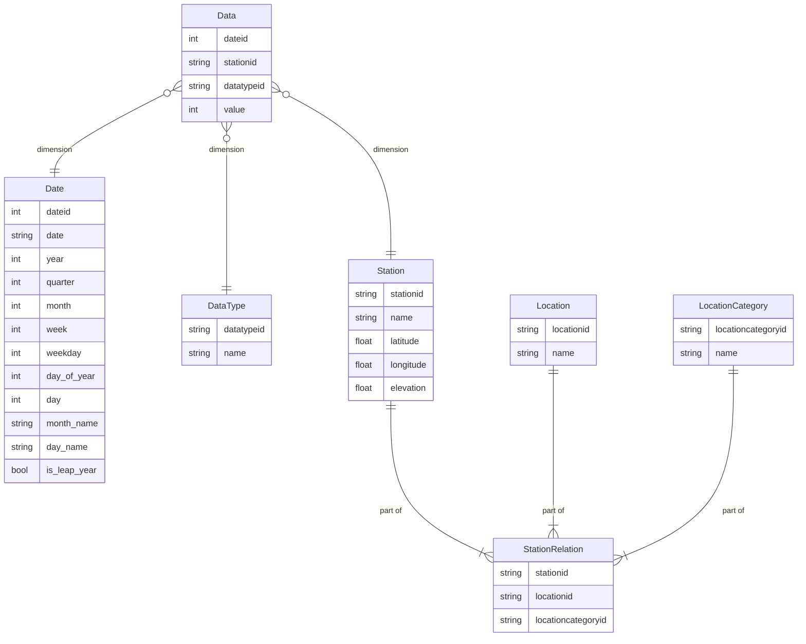
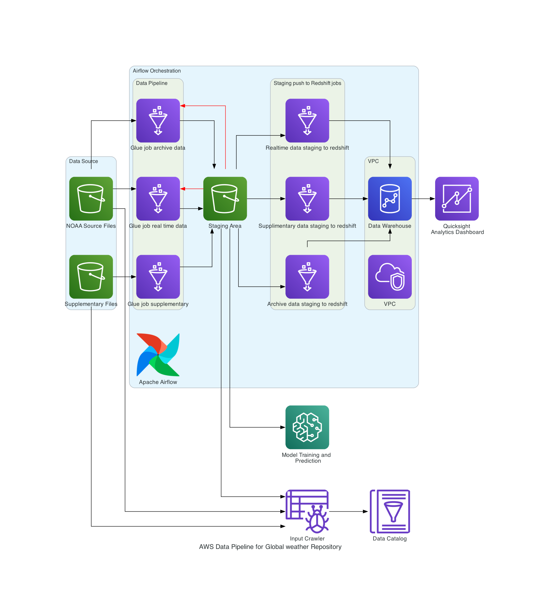

# aws-etl-pipeline-weather-data-analysis

Build ETL pipeline to ingest data from NOAA Global Historical Climatology Network Daily (GHCN-D) AWS S3 bucket. Write queries, inference script and build visualizations for analysis. Schedule jobs using Apache Airflow.

## data schema

## pipeline diagram

